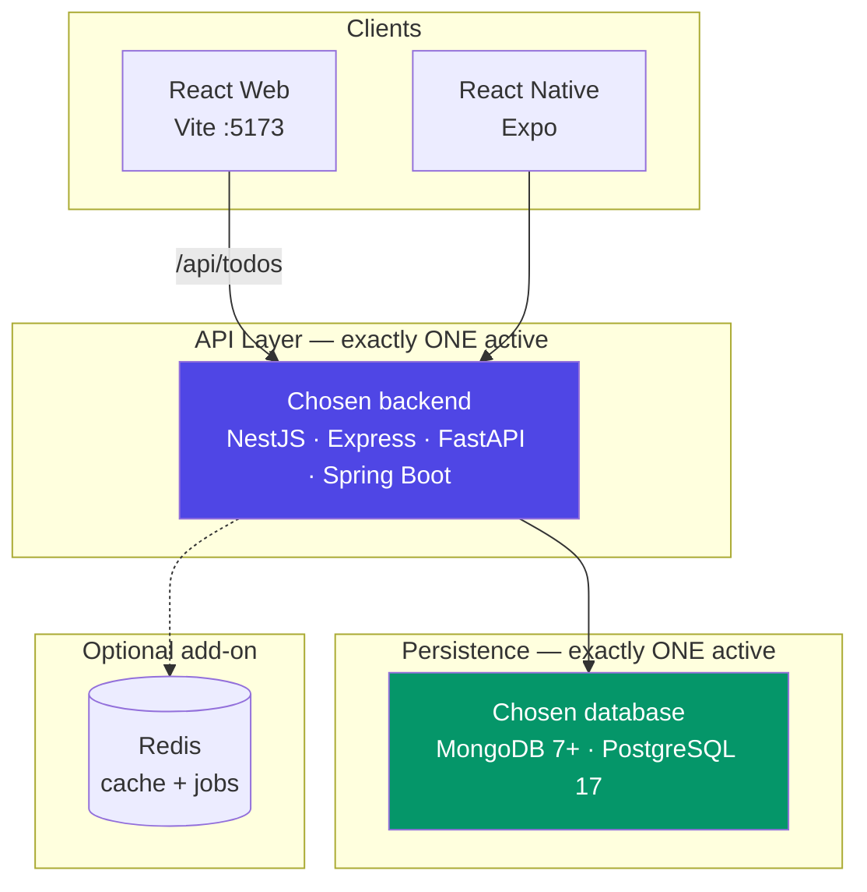

# Polyglot Todo App

> **One product. Pick one backend. Pick one database. Two clients. Zero contract drift.**

A production-grade Todo application implemented as a **polyglot monorepo** — the same domain model, HTTP contract, caching strategy, and optimistic concurrency semantics expressed in **four interchangeable backend implementations** and consumed by **two client platforms**.

**Important:**
- **Backends** are **drop-in alternatives** — deploy **exactly one** at a time (NestJS *or* Express *or* FastAPI *or* Spring Boot).
- **Databases** are **drop-in alternatives** — connect to **exactly one** at a time (MongoDB *or* PostgreSQL), selected via `DB_PROFILE`.
- **Clients** are **not** mutually exclusive — React Web and React Native can both run against the same active backend.
- The monorepo holds all options so you can compare and migrate — not run backends or databases in parallel.

```
┌─────────────────────────────────────────────────────────────────────────────────┐
│                              POLYGLOT TODO APP                                  │
│                                                                                 │
│   ┌──────────────────────┐              ┌──────────────────────┐                │
│   │   React Web (Vite)   │              │  React Native (Expo) │                │
│   │   TanStack Query     │              │  TanStack Query      │                │
│   │   Tailwind CSS v4    │              │  NativeWind          │                │
│   └──────────┬───────────┘              └──────────┬───────────┘                │
│              │         same JSON contract            │                           │
│              └──────────────────┬─────────────────────┘                           │
│                                 │  HTTP/REST                                      │
│   ┌─────────────────────────────▼─────────────────────────────────────────┐   │
│   │                    Unified API — /api/todos                              │   │
│   └─────────────────────────────┬─────────────────────────────────────────┘   │
│                                 │                                              │
│              ┌──────────────────▼──────────────────┐                           │
│              │   ONE backend active at a time        │                           │
│              │  ┌─────┐ ┌─────┐ ┌─────┐ ┌───────┐  │                           │
│              │  │Nest │ │Expr │ │Fast │ │Spring │  │  ← pick one              │
│              │  │ JS  │ │ess 5│ │ API │ │ Boot  │  │                           │
│              │  └─────┘ └─────┘ └─────┘ └───────┘  │                           │
│              └──────────────────┬──────────────────┘                           │
│                         │                                                       │
│              ┌──────────▼──────────┐    ┌─────────────┐                          │
│              │  ONE database:      │    │ Redis (opt) │                          │
│              │  MongoDB or PG      │    │ cache/jobs  │                          │
│              └─────────────────────┘    └─────────────┘                          │
└─────────────────────────────────────────────────────────────────────────────────┘
```

---

## Table of Contents

1. [Why This Exists](#why-this-exists)
2. [Deployment Model](#deployment-model)
3. [Repository Map](#repository-map)
4. [System Architecture](#system-architecture)
5. [The Unified API Contract](#the-unified-api-contract)
6. [Cross-Cutting Concerns](#cross-cutting-concerns)
7. [Backend Implementations](#backend-implementations)
   - [NestJS](#nestjs-todo-nestjs)
   - [Express](#express-todo-express)
   - [FastAPI](#fastapi-todo-fastapi)
   - [Spring Boot](#spring-boot-todo-spring)
8. [Frontend Implementations](#frontend-implementations)
   - [React Web](#react-web-todo-react)
   - [React Native](#react-native-todo-react-native)
9. [Client Comparison](#client-comparison)
10. [Backend Comparison Matrix](#backend-comparison-matrix)
11. [Quick Start](#quick-start)
12. [Testing Strategy](#testing-strategy)
13. [Docker & Operations](#docker--operations)
14. [Architecture Decision Records](#architecture-decision-records)
15. [Further Reading](#further-reading)

---

## Why This Exists

Most "todo app" tutorials teach a framework. This repository teaches **systems design**:

| Principle | How it shows up here |
|---|---|
| **Contract-first design** | All four backends expose the same REST endpoints, status codes, and error envelope shape (see [contract notes](#contract-compatibility) for FastAPI field naming) |
| **Framework-agnostic domain** | Todo CRUD, pagination, status filtering, priority, due dates, and `__v` optimistic locking are invariant |
| **Progressive complexity** | Redis caching and background jobs are **optional** — every backend runs locally with a single database (MongoDB or PostgreSQL) |
| **Production patterns** | Correlation IDs, structured errors, cache-aside reads, write-through eviction, graceful shutdown |
| **Client portability** | React and React Native share types, hooks patterns, and API client shape — point at whichever single backend you deploy |
| **Single-backend deployment** | Four implementations exist in source control; production runs **one** — chosen by your team's stack preference |
| **Single-database deployment** | Two persistence options exist; production connects to **one** — `DB_PROFILE=mongodb` or `DB_PROFILE=postgresql` |

Use this repo to **compare frameworks fairly**, **benchmark runtimes**, **onboard teams onto a stack**, or **prove an API contract** before committing to infrastructure.

---

## Deployment Model

The four backends and two database options are **functionally equivalent replacements**, not cooperating services.

```
                    ┌──────────────────────────────────────┐
                    │           Production / Dev           │
                    │                                      │
  React Web ────────┤  ┌────────────────────────────┐    │
  React Native ─────┤  │  Active backend (pick one): │    │
                    │  │  • NestJS  • Express        │    │
                    │  │  • FastAPI • Spring Boot    │    │
                    │  └─────────────┬──────────────┘    │
                    │                │                   │
                    │  ┌─────────────▼──────────────┐    │
                    │  │  Active database (pick one):│    │
                    │  │  • MongoDB                  │    │
                    │  │  • PostgreSQL               │    │
                    │  └─────────────┬──────────────┘    │
                    │                │                   │
                    │  ┌─────────────▼──────────────┐    │
                    │  │  Redis (optional)           │    │
                    │  └─────────────────────────────┘    │
                    └──────────────────────────────────────┘

  Inactive options: present in repo, not deployed, not connected
```

| Rule | Detail |
|---|---|
| **One backend** | Run a single backend process (or container) per environment |
| **One database** | Set `DB_PROFILE=mongodb` **or** `DB_PROFILE=postgresql` — never both |
| **Same contract** | Whichever backend you pick exposes identical `/api/todos` endpoints |
| **Same data model** | Todo fields, pagination, and `__v` OCC are identical regardless of database |
| **Switching backend** | Stop current backend, start replacement, point clients at its port |
| **Switching database** | Stop backend, change `DB_PROFILE` + connection URI, restart — data does **not** auto-migrate between MongoDB and PostgreSQL |
| **Both clients OK** | React Web and React Native may run together — they share the same backend URL/port |
| **Not for** | Multi-backend mesh, dual-database writes, or polyglot persistence in one deployment |

**Local development:**
- **Never run two backends simultaneously** against the same database — they compete for cache keys and ports.
- **Never set both `MONGODB_URI` and `POSTGRESQL_URI` as active** — `DB_PROFILE` selects exactly one persistence layer; the other connection is ignored.
- Express and Spring Boot both default to port `3001`; only one backend can bind that port at a time.

**Recommended production topology:**

```
[ React Web ] ──► [ Reverse Proxy ] ──► [ ONE backend ] ──► [ ONE database: MongoDB or PostgreSQL ]
[ React Native ] ─────────────────────────────────────────► [ Redis (optional) ]
```

---

## Repository Map

```
polyglot-todo-app/
│
├── README.md               # ← you are here (monorepo overview)
│
├── backend/                # pick ONE deployable
│   ├── todo-nestjs/        # NestJS 11 · SSR (EJS) + REST · :3000
│   ├── todo-express/       # Express 5 · REST only · :3001
│   ├── todo-FastAPI/       # FastAPI · Python 3.12 · :8000
│   └── todo-spring/        # Spring Boot 4 · Java 25 · :3001
│
└── frontend/               # both can run against the same backend
    ├── todo-react/         # React 19 · Vite · :5173
    └── todo-react-native/  # Expo 56 · iOS / Android
```

Every sub-project has its own **README.md** with full architecture docs, setup, and design decisions. Each backend is a **self-contained, mutually exclusive deployable** — its own `docker-compose.yml`, env template, and tests. Use **one** backend `docker-compose.yml` per environment.

---

## System Architecture

### Logical View



> Only **one** database is connected per deployment (`DB_PROFILE`). Redis is optional. The other backend folders and unused database drivers exist in the repo but are **not active** in this topology.

### Layered Design (all backends)

Every implementation follows the same layered architecture:

```
┌─────────────────────────────────────────────────────────┐
│  Presentation    Controllers / Routers / Views (SSR)    │
├─────────────────────────────────────────────────────────┤
│  Application     TodoService — business rules, OCC      │
├─────────────────────────────────────────────────────────┤
│  Infrastructure  Repository · Cache · Job Queue         │
├─────────────────────────────────────────────────────────┤
│  Cross-cutting   Correlation ID · Validation · Errors   │
└─────────────────────────────────────────────────────────┘
```

### Request Lifecycle

```
HTTP Request
     │
     ▼
CorrelationId middleware/filter     ← generate or propagate X-Request-Id
     │
     ▼
Input validation                    ← DTO / Zod / Pydantic / Bean Validation
     │
     ▼
Controller
     │
     ├── GET list  → CacheService.get(key) ──hit──► return
     │                    │
     │                   miss
     │                    ▼
     └── Service ──► Repository ──► Database
     │
     ├── POST      → enqueue background job (if Redis enabled)
     └── mutation  → CacheService.invalidate("todos:list:*")
     │
     ▼
Structured JSON response + X-Request-Id header
```

---

## The Unified API Contract

All backends implement the same endpoints, query parameters, pagination shape, status codes, and error envelope. The React clients are built against the **Node/Java JSON shape** (camelCase + `__v`).

### Contract compatibility

| Backend | JSON field style | Version field | Frontend-ready |
|---|---|---|---|
| NestJS | camelCase (`dueDate`, `createdAt`) | `__v` | ✅ default target |
| Express | camelCase | `__v` | ✅ |
| Spring Boot | camelCase (`@JsonProperty`) | `__v` | ✅ |
| FastAPI | snake_case (`due_date`, `created_at`) | `revision` | ⚠️ requires field mapping |

> Use **NestJS, Express, or Spring Boot** with the bundled React / React Native clients out of the box. For **FastAPI**, add Pydantic serialization aliases in `schemas.py` or map fields in the client — see [`backend/todo-FastAPI/README.md`](backend/todo-FastAPI/README.md).

### Endpoints

| Method | Path | Description | Success |
|---|---|---|---|
| `GET` | `/health` | Liveness + dependency status | `200` |
| `GET` | `/api/todos` | Paginated list with optional status filter | `200` |
| `GET` | `/api/todos/:id` | Single todo by ID | `200` / `404` |
| `POST` | `/api/todos` | Create todo | `201` |
| `PUT` | `/api/todos/:id` | Partial update (all body fields optional) | `200` / `404` / `409` |
| `DELETE` | `/api/todos/:id` | Hard delete | `200` / `404` |

### Query Parameters — `GET /api/todos`

| Param | Type | Default | Constraints |
|---|---|---|---|
| `page` | integer | `1` | min 1 |
| `limit` | integer | `10` | min 1, max 100 |
| `status` | string | — | `todo` \| `doing` \| `done` |

### Domain Model

| Field | Type | Required | Default | Notes |
|---|---|---|---|---|
| `_id` | string | auto | — | MongoDB ObjectId or UUID string (same API shape in both DB profiles) |
| `title` | string | yes | — | max 200 chars |
| `description` | string | no | — | max 1000 chars |
| `dueDate` | ISO-8601 | no | — | |
| `status` | enum | yes | `todo` | `todo` \| `doing` \| `done` |
| `priority` | integer | yes | `3` | 1 (highest) – 5 (lowest) |
| `createdAt` | ISO-8601 | auto | — | |
| `updatedAt` | ISO-8601 | auto | — | |
| `__v` | integer | auto | `0` | Optimistic concurrency version |

**Index:** `{ status: 1, dueDate: 1 }`

### List Response

```json
{
  "items": [{ "_id": "...", "title": "Buy milk", "status": "todo", "priority": 3, "__v": 0 }],
  "total": 42,
  "page": 1,
  "limit": 10
}
```

### Create Request

```json
{
  "title": "Buy groceries",
  "description": "Milk, eggs, bread",
  "dueDate": "2026-06-15T00:00:00Z",
  "status": "todo",
  "priority": 2
}
```

### Update Request (partial)

```json
{
  "title": "Buy organic groceries",
  "status": "doing",
  "__v": 0
}
```

Send `__v` from the last read. If another client incremented the version, the server returns **409 Conflict**.

### Error Envelope

```json
{
  "statusCode": 422,
  "message": "Validation failed",
  "errors": { "title": "Title is required" },
  "path": "/api/todos",
  "correlationId": "550e8400-e29b-41d4-a716-446655440000",
  "timestamp": "2026-06-07T08:00:00Z"
}
```

### HTTP Status Reference

| Code | Meaning |
|---|---|
| `200` | Successful read, update, or delete |
| `201` | Todo created |
| `400` | Malformed query/path parameters |
| `404` | Todo not found |
| `409` | Optimistic concurrency conflict (`__v` stale) |
| `422` | Request body validation failure |
| `500` | Unhandled server error |

---

## Cross-Cutting Concerns

These behaviors are **identical across all four backends**:

### 1. Request Correlation

Every request receives an `X-Request-Id` header. If the client omits it, the server generates a UUID. The same ID is echoed in the response and embedded in error payloads — enabling end-to-end tracing across logs.

### 2. Cache-Aside Pattern

```
GET /api/todos?page=1&limit=10&status=todo
         │
         ▼
   key = "todos:list:page:1:limit:10:status:todo"
         │
    ┌────┴────┐
    │  HIT?   │──yes──► return cached JSON
    └────┬────┘
        no
         ▼
   query database → set cache (TTL: 30s default) → return

POST / PUT / DELETE  →  invalidate all keys matching "todos:list:*"
```

| Backend | Cache backend (default) | Cache backend (optional) |
|---|---|---|
| NestJS | In-memory Map | Redis (ioredis) |
| Express | In-memory Map | Redis (ioredis) |
| FastAPI | dict shim | redis.asyncio |
| Spring Boot | Caffeine (500 entries) | Redis (configurable) |

Set `REDIS_ENABLED=true` to activate distributed caching. Without Redis, every backend degrades gracefully to in-process storage.

### 3. Background Jobs (optional)

On `POST /api/todos`, a `todo_created` event is enqueued for async processing (logging, future webhooks, analytics):

| Backend | Queue technology | Requires Redis |
|---|---|---|
| NestJS | BullMQ | yes |
| Express | BullMQ | yes |
| FastAPI | ARQ (separate worker process) | yes |
| Spring Boot | Spring `ApplicationEvent` + `@Async` | no |

### 4. Optimistic Concurrency Control

All backends implement document-level versioning. Node/Java clients send and receive `__v`; FastAPI uses `revision` internally (same semantics):

1. Client reads todo with version `N` (`__v` or `revision`)
2. Client sends `PUT` with that version in the body
3. If another write already incremented the version, server returns **409 Conflict**
4. Client reloads and retries

This prevents lost updates without pessimistic locking.

### 5. Database Profile (pick one)

All backends support **two persistence options**, but only **one is active** per deployment. Select via `DB_PROFILE` — the backend loads the matching repository/ORM and ignores the other.

```
DB_PROFILE=mongodb      →  connect via MONGODB_URI     (default)
DB_PROFILE=postgresql   →  connect via POSTGRESQL_URI
```

| Profile | ODM / ORM | Connection var | When to use |
|---|---|---|---|
| `mongodb` (default) | Mongoose / Beanie / Spring Data MongoDB | `MONGODB_URI` | Document model, flexible schema, `__v` via version key |
| `postgresql` | TypeORM / SQLAlchemy + asyncpg / Spring Data JPA | `POSTGRESQL_URI` | Relational model, SQL tooling, ACID transactions |

| Backend | How to switch |
|---|---|
| NestJS, Express, FastAPI | Set `DB_PROFILE` in `.env` |
| Spring Boot | `DB_PROFILE=postgresql` or Spring profile `postgresql` |

**Rules:**
- Set **one** `DB_PROFILE` value — never `mongodb` and `postgresql` at the same time.
- Only the connection URI matching the active profile is used.
- Switching databases requires a backend restart. Data is **not** automatically synced between MongoDB and PostgreSQL.
- The HTTP API contract is unchanged — clients cannot tell which database is behind the backend.

---

## Backend Implementations

> **Reminder:** These are four ways to implement the same service. Choose **one** for your deployment. The sections below document each option — not a checklist of services to run together.

### NestJS (`todo-nestjs`)

> The reference implementation — full-stack with SSR pages **and** a REST API. Deploy this **instead of** Express, FastAPI, or Spring Boot.

| Attribute | Value |
|---|---|
| Framework | NestJS 11 (Express platform) |
| Language | TypeScript 5 |
| Default port | `3000` |
| Unique feature | **EJS server-side rendering** at `/todos/*` |
| Validation | class-validator + class-transformer + Joi (config) |
| Testing | Jest + Supertest + mongodb-memory-server |
| Docs | Compodoc-generated API documentation |

**Module graph:**

```
AppModule
├── ConfigModule (global)
├── MongooseModule / TypeOrmModule
├── CacheModule (global)
├── HealthModule
├── TodosModule
│   ├── TodosApiController    → /api/todos
│   ├── TodosViewController   → /todos (SSR)
│   └── TodosService
└── JobsModule → TodoQueueService (BullMQ)
```

**SSR routes** (NestJS only):

| Method | Path | Action |
|---|---|---|
| `GET` | `/todos` | List page |
| `GET` | `/todos/new` | Create form |
| `GET` | `/todos/:id` | Detail page |
| `GET` | `/todos/:id/edit` | Edit form |
| `POST` | `/todos` | Create (form) |
| `POST` | `/todos/:id/update` | Update (form) |
| `POST` | `/todos/:id/delete` | Delete (form) |

```bash
cd backend/todo-nestjs
cp env.example .env
npm install && npm run start:dev
# API → http://localhost:3000/api/todos
# SSR → http://localhost:3000/todos
```

📄 Deep dive: [`backend/todo-nestjs/README.md`](backend/todo-nestjs/README.md)

---

### Express (`todo-express`)

> Minimal, explicit, framework-free — the same features without NestJS decorators. Deploy this **instead of** NestJS, FastAPI, or Spring Boot.

| Attribute | Value |
|---|---|
| Framework | Express 5 |
| Language | TypeScript 5 |
| Default port | `3001` |
| Validation | Zod 3 (schema = types + runtime) |
| Logging | Winston |
| Testing | Vitest + Supertest + mongodb-memory-server |

**Key design choices:**

- **Express 5 native async errors** — `async` route handlers propagate rejections without `express-async-errors`
- **Read-only `req.query`** — validated query values live in `res.locals.validated.query` (Express 5 getter semantics)
- **Factory pattern** — `createApp()` wires repositories, cache, and queue for testability
- **Graceful shutdown** — SIGTERM/SIGINT drains HTTP server and BullMQ workers

```
src/
├── app.ts                          # createApp() factory
├── server.ts                       # bootstrap + graceful shutdown
├── common/middleware/              # validate, correlation-id, error-handler
└── modules/todos/
    ├── controllers/
    ├── service/
    ├── repository/                 # Mongoose + TypeORM implementations
    ├── router/
    └── validators/                 # Zod schemas
```

```bash
cd backend/todo-express
cp .env.example .env
npm install && npm run dev
# → http://localhost:3001/api/todos
```

📄 Deep dive: [`backend/todo-express/README.md`](backend/todo-express/README.md)

---

### FastAPI (`todo-FastAPI`)

> Async-first Python — dual database support with Pydantic v2 end-to-end. Deploy this **instead of** NestJS, Express, or Spring Boot.

| Attribute | Value |
|---|---|
| Framework | FastAPI 0.115+ |
| Server | Uvicorn (ASGI) |
| Language | Python 3.12 |
| Default port | `8000` |
| Validation | Pydantic v2 + pydantic-settings |
| Jobs | ARQ (separate `worker.py` process) |
| Testing | pytest + pytest-asyncio + httpx + fakeredis |

**Module layout:**

```
app/
├── main.py              # lifespan, middleware, exception handlers
├── config.py            # BaseSettings with startup validation
├── database.py          # MongoDB / PostgreSQL init
├── common/
│   ├── middleware.py    # CorrelationIdMiddleware (ASGI)
│   └── exceptions.py    # structured error handlers
├── todos/
│   ├── models.py        # Beanie Document
│   ├── schemas.py       # request/response DTOs
│   ├── service.py       # business logic
│   ├── router.py        # /api/todos
│   ├── mongo_repository.py
│   └── postgres_repository.py
├── cache/service.py
├── jobs/                # ARQ tasks + worker entry point
└── health/router.py
```

```bash
cd backend/todo-FastAPI
cp env.example .env
python -m venv .venv && source .venv/bin/activate
pip install -r requirements.txt -r requirements-dev.txt
uvicorn app.main:app --reload --port 8000
# → http://localhost:8000/api/todos
# → http://localhost:8000/docs  (auto-generated OpenAPI)
```

📄 Deep dive: [`backend/todo-FastAPI/README.md`](backend/todo-FastAPI/README.md)

---

### Spring Boot (`todo-spring`)

> Enterprise JVM stack — layered architecture with full ADR documentation. Deploy this **instead of** NestJS, Express, or FastAPI.

| Attribute | Value |
|---|---|
| Framework | Spring Boot 4.0.6 |
| Language | Java 25 |
| Default port | `3001` |
| Validation | Jakarta Bean Validation |
| Cache | Caffeine (default) / Redis (optional) |
| Async events | `ApplicationEventPublisher` + `@Async` |
| Testing | JUnit 5 + MockMvc + embedded MongoDB (Flapdoodle) |
| DB profiles | MongoDB (default) + PostgreSQL via `DB_PROFILE` / Spring profile |

**Package structure:**

```
com.todo/
├── controller/         TodoController, HealthController
├── service/            TodoService (interface) + TodoServiceImpl
├── repository/         TodoRepository (MongoDB or JPA per profile)
├── model/              Todo (@Document), TodoStatus
├── dto/                request + response records
├── config/             MongoConfig, AsyncConfig, WebConfig, AppProperties
├── common/             GlobalExceptionHandler, CorrelationIdFilter, ApiError
└── event/              TodoCreatedEvent, TodoEventListener
```

```bash
cd backend/todo-spring
export MONGODB_URI=mongodb://localhost:27017/todos
./mvnw spring-boot:run
# → http://localhost:3001/api/todos
```

📄 Deep dive: [`backend/todo-spring/README.md`](backend/todo-spring/README.md) — includes HLD, LLD, database design, and ADRs.

---

## Frontend Implementations

Both clients are **backend-agnostic** — they connect to **whichever single backend you have running**. They speak the unified `/api/todos` contract and share identical TypeScript types, React Query hook patterns, and Zod form validation. Change the proxy URL or `API_BASE_URL` when you switch backends; no other client code changes are needed.

### React Web (`todo-react`)

| Layer | Technology |
|---|---|
| Framework | React 19 |
| Build | Vite 8 + TypeScript 6 |
| Styling | Tailwind CSS v4 (`@tailwindcss/vite`) |
| Data fetching | TanStack React Query v5 |
| HTTP | Axios |
| Forms | React Hook Form + Zod 4 |
| Icons | Lucide React |

**Architecture:**

```
src/
├── api/todos.ts           # Axios client (baseURL: /api)
├── hooks/useTodos.ts      # React Query hooks + cache keys
├── types/todo.ts          # shared domain types
├── components/
│   ├── TodoCard.tsx       # card with edit/delete actions
│   ├── TodoForm.tsx       # create/edit modal with Zod validation
│   ├── TodoFilters.tsx    # status filter tabs
│   ├── Pagination.tsx
│   ├── StatusBadge.tsx
│   ├── PriorityDots.tsx
│   ├── EmptyState.tsx
│   ├── ConfirmDialog.tsx
│   └── TodoCardSkeleton.tsx
└── App.tsx                # page orchestration
```

**Dev proxy** — Vite forwards `/api` to the NestJS backend by default:

```typescript
// vite.config.ts
server: {
  port: 5173,
  proxy: { '/api': { target: 'http://localhost:3000', changeOrigin: true } },
}
```

To point at a different backend, change the proxy `target` or set Axios `baseURL` directly.

```bash
cd frontend/todo-react
npm install && npm run dev
# → http://localhost:5173
```

**Features:**

- Responsive 3-column card grid with skeleton loading states
- Status filter (`all` / `todo` / `doing` / `done`) with pagination
- Create and edit modal with optimistic `__v` on updates
- Delete confirmation dialog
- Manual refresh via header button + React Query `refetch`
- Error banner with retry
- 9 items per page with `keepPreviousData` pagination

📄 Deep dive: [`frontend/todo-react/README.md`](frontend/todo-react/README.md)

---

### React Native (`todo-react-native`)

| Layer | Technology |
|---|---|
| Framework | React Native 0.85 + Expo 56 |
| Navigation | Single-screen (`TodoListScreen`); React Navigation 7 in deps for extension |
| Styling | NativeWind 4 (Tailwind for RN) |
| Data fetching | TanStack React Query v5 |
| HTTP | Axios |
| Forms | React Hook Form + Zod 4 |
| Gestures | react-native-gesture-handler + Reanimated 4 |

**Architecture:**

```
src/
├── api/todos.ts              # Axios client
├── constants/api.ts          # platform-aware base URL
├── hooks/useTodos.ts         # identical hook pattern to React web
├── types/todo.ts             # identical types to React web
├── screens/
│   ├── TodoListScreen.tsx    # FlatList + pull-to-refresh
│   └── TodoFormModal.tsx     # create/edit bottom sheet
└── components/               # mirrored component set
    ├── TodoCard.tsx
    ├── TodoFilters.tsx
    ├── StatusBadge.tsx
    └── ...
```

**Platform-aware API URL:**

```typescript
// constants/api.ts
const LOCAL_HOST = Platform.OS === 'android' ? '10.0.2.2' : 'localhost';
export const API_BASE_URL = `http://${LOCAL_HOST}:3000/api`;
```

| Environment | Host to use |
|---|---|
| iOS Simulator | `localhost` |
| Android Emulator | `10.0.2.2` |
| Physical device | Your machine's LAN IP |

```bash
cd frontend/todo-react-native
npm install && npm start
# Press `i` for iOS simulator, `a` for Android emulator
```

**Features:**

- Native `FlatList` with `RefreshControl` pull-to-refresh
- Bottom-sheet style create/edit modal
- Platform-safe area handling
- Identical CRUD + filter + pagination UX to the web app
- 10 items per page; inline prev/next pagination in list footer

📄 Deep dive: [`frontend/todo-react-native/README.md`](frontend/todo-react-native/README.md)

---

## Client Comparison

Both frontends share `types/todo.ts`, `hooks/useTodos.ts`, and `api/todos.ts` patterns. They can run **simultaneously** against one backend.

| Attribute | React Web | React Native |
|---|---|---|
| **Default dev URL** | `http://localhost:5173` | Expo Metro |
| **API connection** | Vite proxy `/api` → backend | Direct `API_BASE_URL` in `constants/api.ts` |
| **Default backend port** | `3000` (NestJS proxy target) | `3000` |
| **List layout** | CSS Grid (3 columns) | `FlatList` |
| **Page size** | 9 | 10 |
| **Refresh** | Header button + `refetch` | `RefreshControl` pull-to-refresh |
| **Forms** | Modal overlay | Full-screen `Modal` |
| **Styling** | Tailwind CSS v4 | NativeWind v4 |

---

## Backend Comparison Matrix

Use this table to **choose** which single backend to deploy — not to run them all.

| Capability | NestJS | Express | FastAPI | Spring Boot |
|---|---|---|---|---|
| **Language** | TypeScript | TypeScript | Python 3.12 | Java 25 |
| **Paradigm** | Decorator DI | Functional factories | Async DI (Depends) | Annotation DI |
| **Default port** | 3000 | 3001 | 8000 | 3001 |
| **SSR pages** | ✅ EJS | ❌ | ❌ | ❌ |
| **OpenAPI docs** | Manual | Manual | ✅ Auto-generated | Manual |
| **Validation** | class-validator | Zod | Pydantic v2 | Jakarta Validation |
| **DB profile: MongoDB** | Mongoose | Mongoose | Beanie + Motor | Spring Data MongoDB |
| **DB profile: PostgreSQL** | TypeORM | TypeORM | SQLAlchemy + asyncpg | Spring Data JPA |
| **DB switch mechanism** | `DB_PROFILE` | `DB_PROFILE` | `DB_PROFILE` | Spring profile |
| **Cache (default)** | In-memory | In-memory | In-memory | Caffeine |
| **Cache (optional)** | Redis | Redis | Redis | Redis |
| **Job queue** | BullMQ | BullMQ | ARQ | Spring Events |
| **Correlation ID** | Middleware + Interceptor | Middleware | ASGI Middleware | Servlet Filter |
| **OCC (version field)** | `__v` | `__v` | `revision` | `__v` |
| **Docker** | ✅ Multi-stage | ✅ Multi-stage | ✅ Multi-stage | ✅ Multi-stage |
| **Test runner** | Jest | Vitest | pytest | JUnit 5 |

---

## Quick Start

### Prerequisites

| Tool | Version | Used by |
|---|---|---|
| Node.js | ≥ 20 | NestJS, Express, React, React Native |
| Python | 3.12 | FastAPI |
| Java | 25 | Spring Boot |
| MongoDB **or** PostgreSQL | 7+ / 17+ | All backends — **one** per deployment (`DB_PROFILE`) |
| Redis | 7+ | Optional (cache + jobs) |
| Docker | Latest | All backends |

### Fastest path — one backend + React

Pick **one** row from the table below. Do not start multiple backends.

```bash
# Terminal 1 — Backend (example: NestJS + MongoDB)
cd backend/todo-nestjs
cp env.example .env
# .env → DB_PROFILE=mongodb  (or postgresql + POSTGRESQL_URI)
docker compose --profile mongodb up -d    # start only the MongoDB profile — not both DBs
npm install && npm run start:dev

# Terminal 2 — Frontend
cd frontend/todo-react
npm install && npm run dev
```

Open **http://localhost:5173** — the Vite proxy routes `/api` to NestJS on port 3000.

### Full stack — backend + both clients

With NestJS running on `:3000`, you can start **both** frontends in separate terminals:

```bash
# Terminal 2 — React Web
cd frontend/todo-react && npm run dev

# Terminal 3 — React Native (optional)
cd frontend/todo-react-native && npm start
# Press i (iOS) or a (Android)
```

React Web uses the Vite proxy. React Native uses `src/constants/api.ts` (defaults to `:3000`).

### Choose your backend (run only one)

| Backend | Start command | React proxy target | RN `API_BASE_URL` port |
|---|---|---|---|
| NestJS | `npm run start:dev` | `http://localhost:3000` | `:3000` |
| Express | `npm run dev` | `http://localhost:3001` | `:3001` |
| FastAPI | `uvicorn app.main:app --reload` | `http://localhost:8000` | `:8000` |
| Spring Boot | `./mvnw spring-boot:run` | `http://localhost:3001` | `:3001` |

The API contract is identical — only the port changes. **Stop the current backend before starting another.** Express and Spring Boot both use port `3001` by default; NestJS uses `3000`, FastAPI uses `8000`.

### Choose your database (connect only one)

| Profile | Set in `.env` | Docker Compose command | Connection var |
|---|---|---|---|
| MongoDB (default) | `DB_PROFILE=mongodb` | `docker compose --profile mongodb up -d` | `MONGODB_URI` |
| PostgreSQL | `DB_PROFILE=postgresql` | `DB_PROFILE=postgresql docker compose --profile postgresql up -d` | `POSTGRESQL_URI` |

Each database is gated behind a Compose **profile** (`mongodb` or `postgresql`). Start **one** profile per deployment — never `--profile mongodb --profile postgresql` together.

---

## Testing Strategy

| Project | Framework | Isolation | Coverage |
|---|---|---|---|
| `todo-nestjs` | Jest + Supertest | mongodb-memory-server | Unit + E2E |
| `todo-express` | Vitest + Supertest | mongodb-memory-server | Unit + integration |
| `todo-FastAPI` | pytest-asyncio + httpx | mongomock-motor + fakeredis | API + service |
| `todo-spring` | JUnit 5 + MockMvc | Embedded MongoDB (Flapdoodle) | Integration |
| `todo-react` | ESLint | — | `npm run lint` |
| `todo-react-native` | TypeScript | — | `npx tsc --noEmit` (manual) |

**Shared test scenarios** (every backend):

- CRUD happy paths
- Pagination and status filtering
- Validation errors (422)
- Not found (404)
- Optimistic concurrency conflict (409)
- Cache invalidation on writes
- Health endpoint dependency checks

Run tests per project:

```bash
# NestJS
cd backend/todo-nestjs && npm test

# Express
cd backend/todo-express && npm test

# FastAPI
cd backend/todo-FastAPI && pytest

# Spring Boot
cd backend/todo-spring && ./mvnw test
```

---

## Docker & Operations

Each backend ships its **own** `docker-compose.yml` — a complete, standalone stack. Use **one** per environment:

```
┌─────────────┐     ┌────────────────────┐     ┌───────┐
│   App       │────▶│ ONE database       │     │ Redis │
│ (one of 4)  │     │ MongoDB or Postgres│     │ (opt) │
└─────────────┘     └────────────────────┘     └───────┘
```

```bash
# Example — Express + MongoDB (default profile)
cd backend/todo-express
REDIS_ENABLED=true docker compose --profile mongodb up --build

# Example — Express + PostgreSQL (profile activates PG only)
cd backend/todo-express
DB_PROFILE=postgresql REDIS_ENABLED=true docker compose --profile postgresql up --build
```

Do **not** run `docker compose up` in all four `backend/*` directories simultaneously — you would spawn four competing API servers. Start **one** database service matching your `DB_PROFILE`, not MongoDB and PostgreSQL together.

### Default Ports

| Service | Port |
|---|---|
| NestJS | 3000 |
| Express | 3001 |
| FastAPI | 8000 |
| Spring Boot | 3001 |
| React (Vite dev) | 5173 |
| MongoDB | 27017 |
| Redis | 6379 |
| PostgreSQL | 5432 |

### Environment Variables (common)

| Variable | Description | Default |
|---|---|---|
| `PORT` | HTTP listen port | varies by backend |
| `DB_PROFILE` | **Active** database: `mongodb` or `postgresql` (mutually exclusive) | `mongodb` |
| `MONGODB_URI` | MongoDB connection — used only when `DB_PROFILE=mongodb` | `mongodb://localhost:27017/todos` |
| `POSTGRESQL_URI` | PostgreSQL connection — used only when `DB_PROFILE=postgresql` | — |
| `REDIS_ENABLED` | Enable Redis cache + jobs | `false` |
| `REDIS_HOST` / `REDIS_PORT` | Redis connection | `127.0.0.1:6379` |
| `CACHE_TTL_SECONDS` | List cache TTL | `30` |

---

## Architecture Decision Records

### ADR-001: Contract-first, single-deployable polyglot backends

**Context:** Teams need to evaluate or migrate between Node, Python, and JVM stacks without rewriting clients — but they only need **one** API server in production.

**Decision:** Define a single HTTP contract. Implement it independently in four frameworks as **mutually exclusive deployables**. No shared runtime code — only shared semantics. Deploy exactly one backend per environment.

**Consequence:** Slight duplication of business logic across repos folders, but total freedom to pick a runtime. Clients remain unchanged when switching backends. This is **not** a microservices architecture.

---

### ADR-002: Mutually exclusive database profiles

**Context:** Teams want flexibility between document and relational stores, but running two databases in one deployment adds complexity with no benefit for this use case.

**Decision:** Support MongoDB and PostgreSQL as **drop-in alternatives** via `DB_PROFILE`. Exactly **one** profile is active per deployment. MongoDB is the default; PostgreSQL is selected by changing `DB_PROFILE` and the connection URI.

**Consequence:** Each backend ships two repository implementations, but only one is wired at startup. `__v` optimistic locking maps to Mongoose `versionKey` or a PostgreSQL version column. Switching databases requires restart and manual data migration — the API contract stays the same.

---

### ADR-003: Redis is optional, not required

**Context:** Developers should run the full app locally with minimal infrastructure.

**Decision:** Every backend ships an in-memory cache fallback. BullMQ/ARQ jobs are silently skipped when Redis is disabled.

**Consequence:** Production deployments opt in via `REDIS_ENABLED=true`. Local dev works with a single database and no Redis.

---

### ADR-004: Shared client types, not shared client code

**Context:** React and React Native have different rendering primitives but identical data needs.

**Decision:** Duplicate thin type definitions and mirror hook patterns. Do not extract a shared npm package (keeps each frontend self-contained).

**Consequence:** Types stay in sync by convention. Both clients remain independently deployable.

---

### ADR-005: Optimistic concurrency over pessimistic locking

**Context:** Todo updates are infrequent and user-scoped. Lock contention is unlikely.

**Decision:** Use document versioning (`__v` on Node/Java, `revision` on FastAPI). Return 409 on stale writes.

**Consequence:** Clients must handle conflict UX (reload + retry). No distributed locks required. React clients send `__v` on PUT today.

---

## Further Reading

| Document | Contents |
|---|---|
| [`backend/todo-nestjs/README.md`](backend/todo-nestjs/README.md) | Module graph, SSR routes, cache flow, Compodoc |
| [`backend/todo-express/README.md`](backend/todo-express/README.md) | Express 5 patterns, Zod validation, graceful shutdown |
| [`backend/todo-FastAPI/README.md`](backend/todo-FastAPI/README.md) | ASGI lifecycle, ARQ worker, dual DB repositories |
| [`backend/todo-spring/README.md`](backend/todo-spring/README.md) | Full HLD/LLD, ADRs, database design, deployment |
| [`frontend/todo-react/README.md`](frontend/todo-react/README.md) | React Query hooks, Vite proxy, component map, backend switching |
| [`frontend/todo-react-native/README.md`](frontend/todo-react-native/README.md) | Expo setup, platform hosts, FlatList UX, API_BASE_URL config |

---

<p align="center">
  <strong>Built to compare frameworks fairly. Designed to run in production.</strong><br/>
  <sub>Pick one backend. Pick one database. Point both clients at it. Ship the same product.</sub>
</p>
